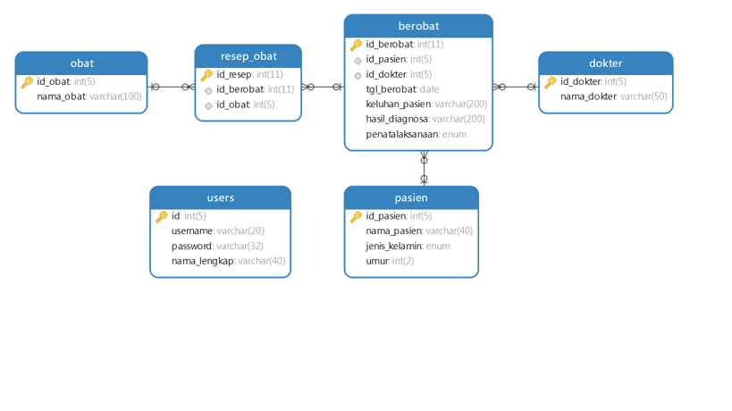
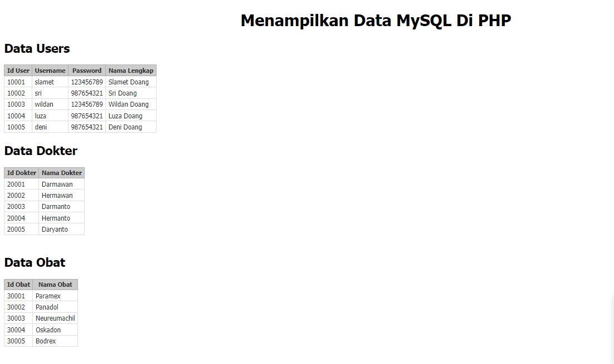
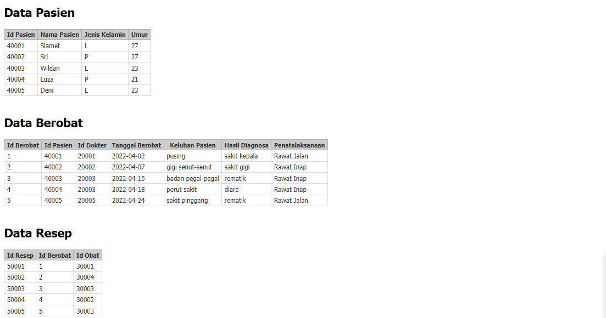

# Sistem Basis Data TI20D2
Nama	: Slamet  
NIM   : 312010241  
Kelas : TI20D2  
 
# Koneksi Database ke MySQL dengan PHP
Database Klinik  
Terdapat 6 Table  
1. Users  
2. Dokter  
3. Obat <b>
4. Pasien  
5. Berobat  
6. Resep  
# Design Database
    
# Screenshoot index
  
  
